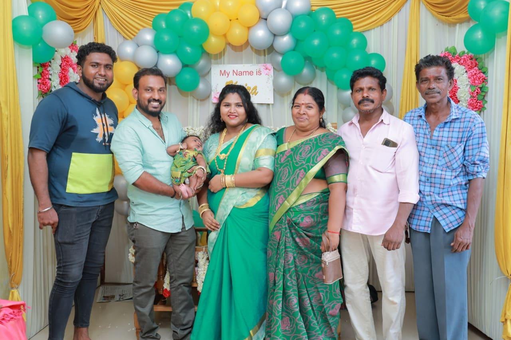

### add more image optiion

 " <section class="blessings section-shell reveal">
          

            

              
            

            

              
With Love & Blessings

              <h3>Your presence, blessings and love will make our special day even more meaningful.</h3>
            

          

        </section>

        "
- abov i mention the old code from index.html
- change design to add more images option for add more family images 4 images options like.

### also music default on
- kindly our website music switch is off change to default option to switch on.